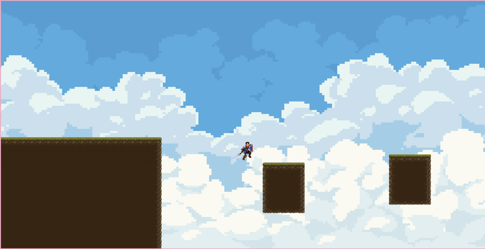
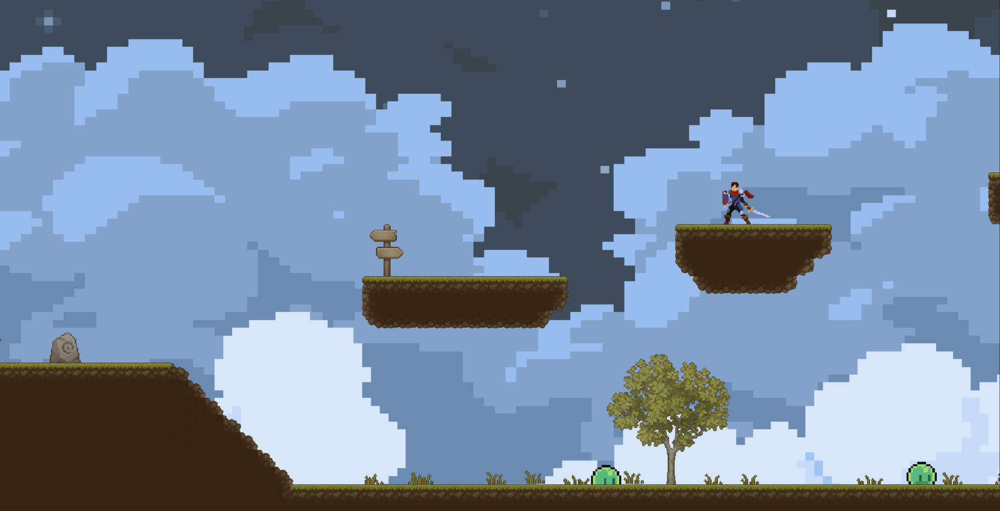
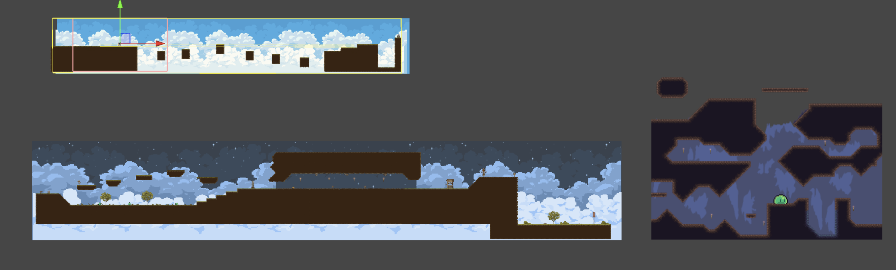
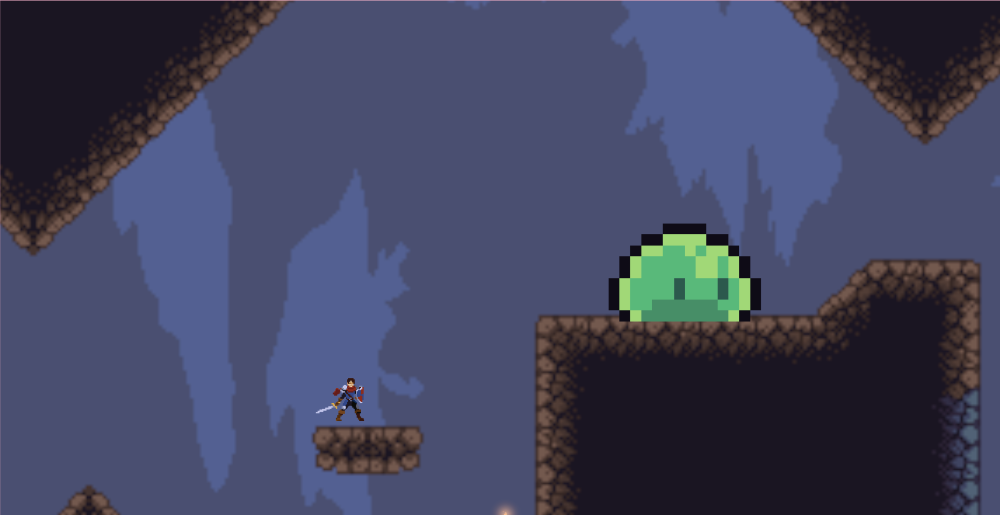
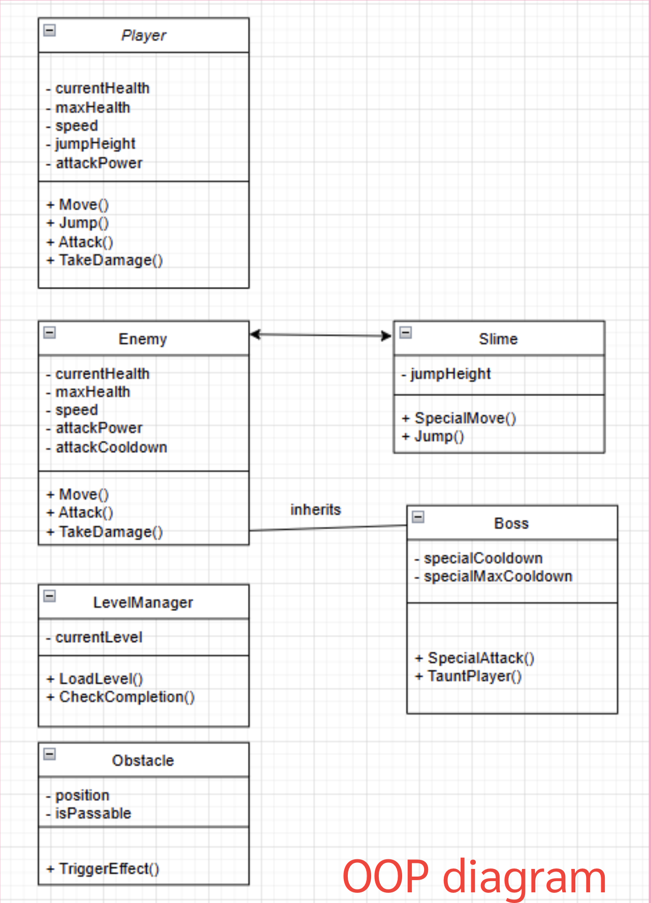

# Hero Knight: The Slime War

## Overview
This project is a 2D side-scrolling game developed in Unity.  
It focuses on building a complete gameplay system including player movement, enemy behavior, interaction systems, and modular game architecture.

The goal of this project is to design and implement a playable game with smooth mechanics and well-structured code using object-oriented programming.

---

## Gameplay

---

## Game System

---

## System Design

This project is built using object-oriented programming principles.  
The game logic is separated into modular components for better scalability and maintainability.

Key systems include:

- Player system with movement, attack, and state control  
- Enemy system with behavior logic and interaction  
- Level management system for handling progression  
- Obstacle system for environmental interaction  

---

## OOP Design

The system design follows OOP principles such as:

- Encapsulation for managing player and enemy states  
- Inheritance for extending enemy types (e.g., slime, boss)  
- Modularity to separate gameplay systems into independent components  

---

## Technical Highlights

- Implemented a state-based system (IDLE, MOVE) for character behavior  
- Designed click-to-move interaction using raycasting  
- Built dynamic animation control system with runtime UI  
- Developed moving platforms with velocity transfer  
- Implemented elevator system with smooth motion using second-order dynamics  

---

## Challenges

Movement and collision handling were challenging due to inconsistent behavior and jitter.  
This was solved by refactoring the movement system and normalizing direction vectors.

Managing animation states dynamically was also complex.  
A custom animation panel system was implemented to control animation states at runtime.

---

## What I Learned

- Object-oriented programming in real game systems  
- Game physics and movement handling  
- Designing scalable and modular systems  
- Debugging complex gameplay interactions  

---

## Future Improvements

- Add AI-based enemy behavior and adaptive difficulty  
- Implement pathfinding (e.g., A* algorithm)  
- Improve game balancing and level design  
